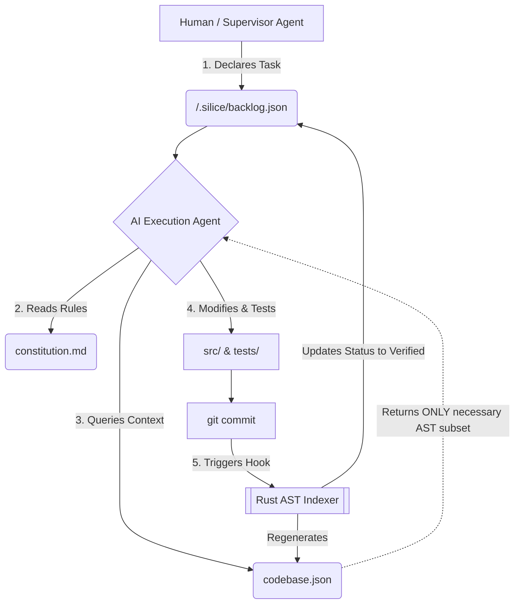

# Silice Protocol V4: Self-Indexing Spec Engine

An atomic, "Spec-as-Source" orchestration framework designed to eliminate token-waste and context-entropy in AI-driven development. 

This repository establishes the blueprint for a **Single Source of Ontology (S2O)**, where codebases auto-index their own AST (Abstract Syntax Tree) architecture directly into a digital twin on every Git lifecycle event.

Traditional AI development suffers from *vibe coding* and massive token drain because LLMs are fed entire repositories to understand context. **Silice V4** enforces a strict separation of concerns through an automated, isolated metadata directory, achieving an absolute zero-waste token flow.

---

<div align="center">

**Made with ❤️ by Plantacerium**

[](https://ko-fi.com/plantacerium)

⭐ **Star us on GitHub** ⭐
</div>

---

## The Ontology Structure (`/.silice/`)

All metadata, project constitutions, active state machines, and code maps are contained strictly within the root directory `/.silice/`. 

```text
/.silice/
├── constitution.md   # Immutable repo laws (Philosophy + Tech Stack + Agent Limits)
├── blueprint.md      # Structural architecture maps (Mermaid.js) & Domain models
├── backlog.json      # Machine-readable task orchestration matrix (No Markdown drift)
└── codebase.json     # The Digital Twin: Auto-generated AST mapping of files & functions
```

Component Breakdown
* constitution.md: The physical laws of the repository. Rarely updated. Defines the atomic monolith philosophy, pure functions, strict dependency locks, and the operational boundaries of programming agents.
* blueprint.md: Structural flow and conceptual truth. Updated upon phase completion. Agents interpret these definitions to preserve architectural design compliance.
* backlog.json: Task orchestration matrix. Updated programmatically per completed task to prevent agent Markdown corruption.
* codebase.json: The Digital Twin. Auto-generated via Git hooks. Never edited by humans. Contains multi-language AST extraction capturing file imports, inverted dependents, function signatures, and localized call graphs.
## The Zero-Waste Lifecycle
Every development iteration follows a rigid deterministic loop integrated with the AI agent.



## Execution Flow:
* Declare: A task is appended to backlog.json.
* Isolate & Ingest: The AI agent parses constitution.md, maps the task's affected_modules to codebase.json, and extracts exclusively those code blocks and signatures. No repository-wide codebase dumps.
* Execute: The agent refactors targeted lines inside src/ ensuring matching assertions in tests/.
* Sync: Upon git commit, an automated pre-commit hook intercepts the staging area, executes the AST Indexer, updates the digital twin, and patches the task status to verified.
## The Engine: Automated Rust Indexer (Roadmap)
The indexing engine is designed to be powered by a lightweight Rust binary leveraging tree-sitter and git2 APIs (highly inspired by structural query engines like Git-AST-Search).
It is compiled as a native utility binary or embedded as an indexer sub-command. It intercepts the Git staging area, parses language syntax blocks concurrently, and maps recursive call graphs without human intervention.
Silice Protocol is an open methodology focused on extreme token economy and deterministic software engineering.

# Sample System Specification. 
SILICE PROTOCOL AI DRIVEN DEVELOPMENT SELF-INDEXING SPEC ENGINE.

---
## ONTOLOGY STRUCTURE (`/.silice/`)
All metadata, project constitutions, active state machines, and code maps are contained strictly within the root directory `/.silice/`.

### `/.silice/constitution.md`
- **Purpose**: Immutable laws of the repository. Rara vez se actualiza.- **Content**: 
  - **Philosophy**: Atomic monolith, pure functions, strict test-driven isolation, absolute token economy (zero-waste contexts).
  - **Tech Stack**: Minimum tolerated versions, strict dependency locks, and target architectural constraints.
  - **Agent Identity**: Permissions, specific CLI tool bounds, and operational boundaries of the programming agents.

### `/.silice/blueprint.md`
- **Purpose**: Structural flow and conceptual truth. Updated upon phase completion.- **Content**: Mermaid.js sequence and architecture diagrams. High-level routing definitions and domain models. Agents interpret these definitions to preserve design compliance.

### `/.silice/backlog.json`
- **Purpose**: Task orchestration matrix. Updated programmatically per completed task.- **Format**: Structured JSON matrix preventing agent Markdown corruption.- **Schema**:
```json
{
  "tasks": [
    {
      "id": "STRING (e.g., FEAT-001)",
      "title": "STRING",
      "description": "STRING",
      "status": "pending | in_progress | verified",
      "affected_modules": ["ARRAY OF STRINGS"]
    }
  ]
}
```

### `/.silice/codebase.json`
- **Purpose**: The Digital Twin. Auto-generated via Git hooks. Never edited by humans.- **Content**: Multi-language AST extraction capturing file imports, inverted dependents, function signatures, block descriptions, and localized call graphs.

---

<div align="center">

**Made with ❤️ and ☕ by Plantacerium**

[](https://ko-fi.com/plantacerium)

⭐ **Star us on GitHub** ⭐
</div>
